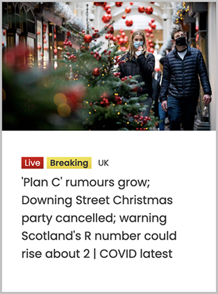

# Exercise 5

## Objectives
Practice working with the CSS box model to create some typical card layouts.

## Instructions
Remember to:
* Regularly save your files and check out what your web page looks like in a web browser.
* Make regular commits and pushes.

## Step 1: Get set up
* Clone your remote exercise repository onto your local machine.
* Add a comment in the head element of the homepage including: the course code and your section number - your name - Exercise 5. Example:
```
<!-- DGL 103 CVS1 - your name - Exercise 5 -->
```
Note: You don't need to edit any of the provided HTML content to complete this exercise. You may need to add links to Google Fonts in the head element.

## Step 2: Code the following 4 cards
### Card 1:
In VS Code, add the following styles to the article element with the class name card-one:
   * Use the Google Font called Poppins and use the rem unit to define all your fonts sizes.
   * Make the image round by using the border-radius property.
   * Give the card a background colour of `hsl(0, 0%, 100%)`.
   * Make the width of the card 500px.
   * Give the card a 50px margin on all four sides so that it isn't so close to the browser window's edges.
   * Give the card 30px of padding on all four sides so that the content doesn't touch the edges of the card.
   * Round the corners of the card by a 5px radius.
   * Give the card a top border that is 3px thick, solid in style and of the color `hsl(180, 62%, 55%)`.
   * Give the card a shadow. Go to https://getcssscan.com/css-box-shadow-examples to find a pleasing shadow.
 When you are finished the card should look like this: <br />
 

### Card 2:
Add the styles to the article element with the class name card-three. The background image is provided in the images folder. The Google fonts are Poppins and Roboto Condensed. Be as exact as you can with your styling, pixel-perfect if possible.<br />


### Card 3:
Add the styles to the article element with the class name card-four. The visual width should be the same as card three. The background image is provided in the images folder. The Google fonts are Poppins and Roboto Condensed. Be as exact as you can with your styling, pixel-perfect if possible. Note that the small text above the headline is not a button.<br />


### Card 4:
Design and code your own card. Read the best practices in this article to inform your design: https://uxplanet.org/ultimate-guide-for-designing-ui-cards-59488a91b44f (a PDF of the article is included in this repo). Both the design and the coding are graded. Your card needs to include:
* An image
* A heading
* A description
* A call-to-action

## Step 3: Format, organize and add comments 
* Use the Prettier VSCode extension to format your code.
* Add organizational CSS comments and order your style rules so that your CSS is easy to read.
* Add a few comments to explain your HTML and CSS code and highlight anything of interest.

## Step 4: Check for errors
* Use the VSCode HTMLHint extension and validate your HTML code to make sure that it is correct: https://validator.w3.org/#validate_by_upload. Take a screenshot of the results.
* Validate your CSS code to make sure that it is correct: https://jigsaw.w3.org/css-validator/ for CSS. Take a screenshot of the results.

**You have now completed your exercise but you still need to push your edits to GitHub and submit it in Brightspace. Make sure to follow the instructions in the How to Complete Your Exercises Guide.**